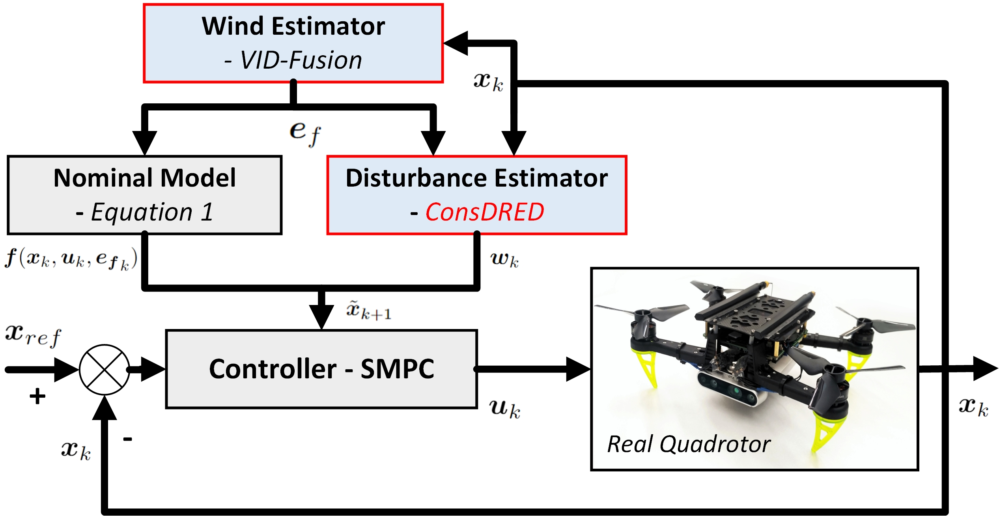

<h1 align="center">Constrained Reinforcement Learning using Distributional Representation for Trustworthy Quadrotor UAV Tracking Control</h1>

    <a href="https://alex-yanranwang.github.io/">Yanran Wang</a>*&nbsp;&nbsp;&nbsp;&nbsp;
    <a href="https://profiles.imperial.ac.uk/david.boyle">David Boyle</a>&nbsp;&nbsp;&nbsp;&nbsp;&nbsp;&nbsp;&nbsp;&nbsp;

    *Corresponding Author&emsp;&emsp;&emsp;

    Systems and Algorithms Lab, Imperial College London, United Kingdom.

    IEEE Transactions on Automation Science and Engineering

    <a href="https://arxiv.org/abs/2302.11694">arXiv</a> &nbsp;&nbsp;
    <a href="https://ieeexplore.ieee.org/document/10614102">Paper</a> &nbsp;&nbsp;
    <a href="https://youtu.be/Yciyalys6XY?si=kYDzHKMGlbNn3pf5">Video</a> &nbsp;&nbsp;
    <a href="https://alex-yanranwang.github.io/ConsDRED-SMPC.html">Project Page</a>

  

## TODOs
- [ ] 📣 Toturial of the practical quadrotor implementation will be released soon!

## Abstract

Simultaneously accurate and reliable tracking control for quadrotors in complex dynamic environments is challenging. The chaotic nature of aerodynamics, derived from drag forces and moment variations, makes precise identification difficult. Consequently, many existing quadrotor tracking systems treat these aerodynamic effects as simple `disturbances' in conventional control approaches. We propose a novel and interpretable trajectory tracker integrating a distributional Reinforcement Learning (RL) disturbance estimator for unknown aerodynamic effects with a Stochastic Model Predictive Controller (SMPC). Specifically, the proposed estimator `Constrained Distributional REinforced-Disturbance-estimator' (ConsDRED) effectively identifies uncertainties between the true and estimated values of aerodynamic effects. Control parameterization employs simplified affine disturbance feedback to ensure convexity, which is seamlessly integrated with the SMPC. We theoretically guarantee that ConsDRED achieves an optimal global convergence rate, and sublinear rates if constraints are violated with certain error decreases as neural network dimensions increase. To demonstrate practicality, we show convergent training, in simulation and real-world experiments, and empirically verify that ConsDRED is less sensitive to hyperparameter settings compared with canonical constrained RL. Our system substantially improves accumulative tracking errors by at least 70%, compared with the recent art. Importantly, the proposed ConsDRED-SMPC framework balances the trade-off between pursuing high performance and obeying conservative constraints for practical implementations.

## Practical Implementation on a real quadrotor

  

## BibTeX

<pre><code>@InProceedings{wang24probabilistic,
    title = {Probabilistic Constrained Reinforcement Learning with Formal Interpretability},
    author = {Wang, Yanran and Qian, Qiuchen and Boyle, David},
    booktitle = {Proceedings of the 41st International Conference on Machine Learning},
    pages = {51303--51327},
    year = {2024},
    volume = {235},
    series = {Proceedings of Machine Learning Research},
    publisher = {PMLR}
  }</code></pre>

If you find this repository helpful, please cite our paper and give us a star!

## Acknowledgements

    This work was partially supported by NSF-UKRI [grant number NE/T011467/1]; and the Engineering and Physical Sciences Research Council [grant number EP/X040518/1].
  

